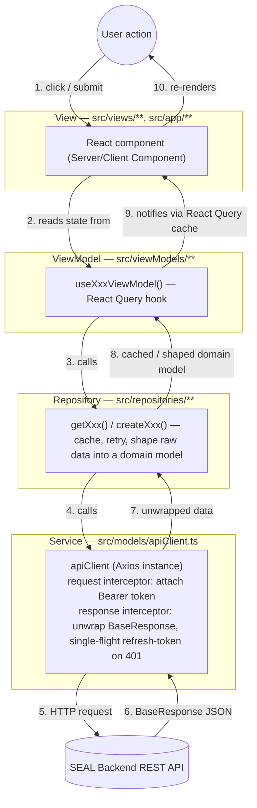
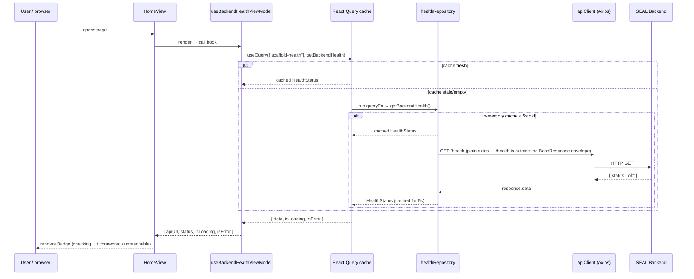

# SEAL Frontend

## Table of Contents

- [Overview](#overview)
- [Tech Stack](#tech-stack)
- [Architecture (4-layer MVVM + Repository)](#architecture-4-layer-mvvm--repository)
- [Dependency Pattern (module singletons, no service locator)](#dependency-pattern-module-singletons-no-service-locator)
- [Project Structure](#project-structure)
- [System Operation Diagram](#system-operation-diagram)
- [Implemented vs Planned](#implemented-vs-planned)
- [Setup & Run](#setup--run)

---

## Overview

SEAL Frontend is the web client for the SEAL competition/event judging platform, built with **Next.js (App Router)**. It talks to [SEAL Backend](../backend) over REST.

This repo was scaffolded from scratch — it does **not** reuse the previous project's UI or code. The previous frontend mixed two parallel auth systems, two API clients, and inconsistent feature-folder layouts, which made the codebase hard to navigate ("mò kiếm code"). This scaffold enforces **one pattern, consistently, everywhere**, so any teammate can predict where a piece of logic lives without searching.

## Tech Stack

| Concern | Technology |
|---|---|
| Framework | Next.js 16 (App Router) |
| UI runtime | React 19 |
| Language | TypeScript only — `allowJs: false`, no `.jsx`/`.js` under `src/` |
| Server state / caching | TanStack React Query v5 |
| HTTP client | Axios (one instance, one interceptor pipeline) |
| Styling | Tailwind CSS v4 |
| Icons | lucide-react |
| Lint | ESLint (`eslint-config-next`) |
| Deployment | Vercel |

## Architecture (4-layer MVVM + Repository)

Instead of the classic 3-layer MVVM (View → ViewModel → Model/Service), this project inserts an explicit **Repository** layer between ViewModel and Service — the same shape as a typical mobile MVVM+Repository stack (View → ViewModel → Repository → DataSource/Service → Network). A ViewModel **never** calls a Service directly; it always goes through that resource's Repository.



**Layer responsibilities**

- **View** (`src/views/`, `src/app/`) — pure rendering. Reads everything from its ViewModel hook; never calls `fetch`/`axios` or holds business state itself. `src/app/` holds only route wiring (layouts, pages) — no logic.
- **ViewModel** (`src/viewModels/`) — one `useXxxViewModel()`/`useXxx()` hook per screen or concern. Owns UI state (loading/error/success) via React Query, calls the Repository, never the Service directly.
- **Repository** (`src/repositories/`) — the resource's single source of truth for the ViewModel layer: short-lived in-memory caching, retry, and turning a raw API response into a domain model. This is the layer that would grow request de-duplication or optimistic-update logic as features are added.
- **Service** (`src/models/apiClient.ts`) — the one and only Axios instance. Request interceptor attaches the `Bearer` access token (skipping public `/Auth/*` routes); response interceptor unwraps the backend's `BaseResponse<T>` envelope and runs a **single-flight refresh-token retry** on `401` (concurrent 401s collapse into one `/Auth/refresh-token` call, then every pending request is retried — the user is only logged out if the refresh itself fails).

## Dependency Pattern (module singletons, no service locator)

Unlike a Flutter/mobile app, a Next.js app doesn't need a `GetIt`-style service locator — ES modules are singletons by default (a module is evaluated once and its exports are shared everywhere it's imported), and React's Context API covers the few things that must be scoped to the component tree.

| Pattern | Where | Lifetime |
|---|---|---|
| **Module singleton** | `src/models/apiClient.ts` exports one `apiClient` instance — every Repository imports the *same* instance | App lifetime (created once at module load) |
| **Module singleton + short TTL cache** | Each file in `src/repositories/` keeps its own `let cached = ...` closure (e.g. `healthRepository.ts`'s 5s cache) | App lifetime, cache entries expire independently |
| **React Context, instantiated once per app mount** | `QueryProvider` creates one `QueryClient` via `useState(() => new QueryClient(...))` and provides it through `QueryClientProvider` | One per browser session (survives client-side navigation, reset on full reload) |
| **Plain hook, no container** | Every `viewModels/useXxx.ts` is just a function — React itself is the "container": call the hook, get an instance scoped to that component's render | Per component instance |

There is nothing to register at startup (no `Program.cs`/`locator.dart` equivalent) — adding a new Repository or ViewModel is just adding a new file; nothing else needs to be wired up.

## Project Structure

```
frontend/
├── src/
│   ├── app/                          # Next.js App Router — routes ONLY, no logic
│   │   ├── layout.tsx  page.tsx      # root layout + landing page (thin, delegates to views/)
│   │   └── (auth)/                   # route group for login/register/etc. (Flow 1, not yet built)
│   │
│   ├── views/                        # View layer — one file per screen, pure rendering
│   │   └── HomeView.tsx
│   │
│   ├── viewModels/                   # ViewModel layer — one hook per screen/concern
│   │   ├── useAuth.ts                # infra only today: useCurrentUser/useIsAuthenticated
│   │   │                             #   (reads localStorage — no login/register mutations yet,
│   │   │                             #    those belong to Flow 1's feature slice when it's built)
│   │   ├── useUserRole.ts
│   │   └── useBackendHealthViewModel.ts
│   │
│   ├── repositories/                 # Repository layer — cache/retry/shape, one file per resource
│   │   └── healthRepository.ts
│   │
│   ├── models/                       # Service layer + shared types
│   │   ├── apiClient.ts              # the ONE Axios instance (interceptors, refresh-token flow)
│   │   └── types.ts                  # BaseResponse<T> / PagedResult<T> / ApiError only —
│   │                                 #   feature-specific types live inside that feature, not here
│   │
│   ├── components/ui/                # design-system primitives — Button, Card, Badge, Input
│   │                                 #   a feature must NEVER redefine its own Button/Card
│   │
│   ├── lib/nav/getNavLinksFor.ts     # centralizes "which role sees which nav link" in ONE place,
│   │                                 #   instead of `if (isAdmin)` scattered across components
│   │
│   ├── providers/QueryProvider.tsx   # React Query client provider (wraps the app once)
│   └── styles/tokens.css             # design tokens (spacing/color/type scale as CSS variables)
│
├── .github/workflows/ci.yml          # npm ci / lint / build
├── next.config.ts  tsconfig.json  eslint.config.mjs
└── package.json
```

When a teammate builds a new flow (e.g. Auth), it gets its own `features/<flow>/{api,components,types}/` folder following this same View→ViewModel→Repository→Service shape — see [`docs/WORKING_PROCESS.md`](../docs/WORKING_PROCESS.md) in the backend repo for the cross-repo team workflow.

## System Operation Diagram

A concrete request, end-to-end — `useBackendHealthViewModel` checking the backend is reachable:



For an **authenticated** request (any real feature once built), the same path goes through `apiClient`'s interceptors: the request interceptor attaches `Authorization: Bearer <accessToken>`, and if the backend answers `401`, the response interceptor transparently calls `/Auth/refresh-token` once (collapsing concurrent 401s into a single refresh call) and retries the original request — the user is only redirected to `/auth` (logged out) if that refresh itself fails.

## Implemented vs Planned

| Piece | Status |
|---|---|
| App shell, routing, Tailwind tokens, design-system primitives (`Button`/`Card`/`Badge`/`Input`) | ✅ Implemented |
| `apiClient` (interceptors, envelope unwrap, refresh-token single-flight) | ✅ Implemented (ported as-is from the previous project — already proven correct) |
| `useAuth`/`useUserRole` (read current session) | ✅ Implemented — infrastructure only |
| Login / Register / forgot-password (Flow 1) | ⏳ Planned — backend `/Auth/*` endpoints don't exist in this repo yet either |
| Events, Teams, Submissions & Scoring, Results screens | ⏳ Planned — each teammate adds their own `features/<flow>/` on top of this scaffold |

## Setup & Run

**Prerequisites**: Node.js (matching `package.json` engines), and [SEAL Backend](../backend) running locally (default `http://localhost:5180/api` — override with `NEXT_PUBLIC_API_URL`).

```bash
npm install

# point at your local backend if it's not on the default port (default: http://localhost:5180/api)
echo "NEXT_PUBLIC_API_URL=http://localhost:5180/api" > .env.local

npm run dev      # http://localhost:3000
```

Build & lint (what CI runs):

```bash
npm run lint
npm run build
```
