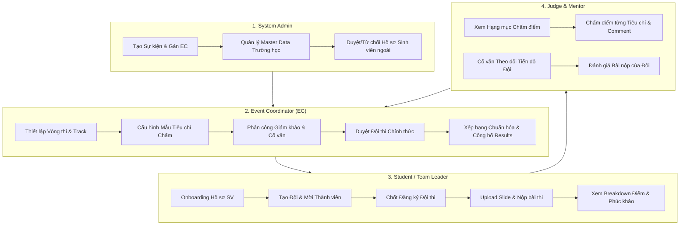

# TÀI LIỆU QUY TRÌNH TÁI THIẾT KẾ & KẾT NỐI API HỆ THỐNG SEAL

> **Repository**: `SU26_SWP_BL3W_FE` (Next.js 16 - React 19 - Tailwind CSS - TanStack Query)  
> **Backend**: `.NET 9 Web API Clean Architecture` (`SU26_SWP_BL3W_BE`)  
> **Ngày cập nhật**: 16/08/2026  

---

## 1. MỤC TIÊU VÀ TỔNG QUAN TÁI THIẾT KẾ

Hệ thống **SEAL (Student Event & Academic Leaderboard)** đã được tái thiết kế toàn bộ theo đúng tài liệu đánh giá kiến trúc `DANH_GIA_LOGIC_THIET_KE_SUBSCREEN_EC.md` và `THIET_KE_CHI_TIET_TAI_CAU_TRUC_EC.md`.

### 🎯 Các Mục Tiêu Đã Hoàn Thành 100%:
1. **Tái thiết kế luồng Sự kiện đi qua 4 Actors**: System Admin, Event Coordinator (EC), Student/Team Leader, Judge/Mentor.
2. **Loại bỏ 100% Mock Data & Fake Repositories**: Đã xóa toàn bộ dữ liệu giả (`DEFAULT_CRITERIAS_LIST`, `DEFAULT_USERS_LIST`, mock ID `res-1`, `sub-101`, `crit-*`, `tpl-*`...).
3. **Tích hợp 100% Backend API**: Toàn bộ 34 màn hình phía Frontend đã được kết nối trực tiếp với 23 Controllers / 80+ Endpoints của Backend `SU26_SWP_BL3W_BE`.
4. **Tối ưu hóa Hạ tầng Kết nối & Khắc phục Lỗi Kỹ thuật**: Tối ưu Timeout/Circuit Breaker tương thích với Render Free-Tier, sửa lỗi vỡ giao diện, lỗi `Maximum update depth exceeded`, lỗi `uncontrolled input` và lỗi bóc tách FluentValidation.

---

## 2. QUY TRÌNH NGHIỆP VỤ SỰ KIỆN QUA 4 ACTORS



### 🔹 Actor 1: System Admin (Quản trị Hệ thống)
- **Tạo Sự kiện mới (`AdminCreateEventView.tsx`)**:
  - Nhập tên sự kiện, mùa giải (Season), năm, thời gian đăng ký & thời gian diễn ra.
  - Chỉ định tài khoản Event Coordinator (EC) phụ trách.
  - Tự động đính kèm cấu hình Vòng sơ loại & Track khởi tạo chuẩn FluentValidation Backend (`POST /api/Events`).
- **Quản lý Trường học (`AdminSchoolsView.tsx`)**:
  - Xem danh sách và tạo mới Trường học (`GET /api/Schools`, `POST /api/Schools`).
- **Duyệt Sinh viên (`AdminUsersView.tsx`)**:
  - Xem danh sách người dùng, duyệt hoặc từ chối kèm lý do đối với sinh viên trường ngoài (`GET /api/Users`, `POST /api/Users/{id}/approve`, `POST /api/Users/{id}/reject`).

---

### 🔹 Actor 2: Event Coordinator (EC - Điều phối viên Sự kiện)
- **Quản lý Chi tiết Sự kiện (`CoordinatorEventDetailView.tsx`)**:
  - Cập nhật thời gian, thông tin, min/max team size.
  - Thêm/Xóa/Sửa các Vòng thi (`Rounds`) và Hạng mục (`Tracks`).
  - Đính kèm Mẫu tiêu chí chấm điểm (`TemplateCriteria`).
- **Phân công Nhân sự (`CoordinatorStaffView.tsx`)**:
  - Mời và gán vai trò Giám khảo (`Judge`) hoặc Cố vấn (`Mentor`) theo từng Hạng mục (`POST /api/EventRoles/assign`, `DELETE /api/EventRoles/{id}`).
- **Duyệt Đội thi (`CoordinatorTeamsView.tsx`)**:
  - Xem danh sách các đội thi ở trạng thái `PendingApproval`.
  - Duyệt đội (`POST /api/Teams/{id}/approve-registration`) để đội chuyển sang trạng thái `Registered` hoặc Từ chối kèm lý do (`reject-registration`).
- **Tính điểm & Công bố Kết quả (`CoordinatorCalibrationView.tsx` & `CoordinatorPublishResultsView.tsx`)**:
  - Khóa nút tính điểm khi còn Giám khảo chưa hoàn tất chấm điểm (`DRAFT`).
  - Tính điểm trung bình có trọng số & xếp hạng Top N (`POST /api/FinalResults/calculate/{roundId}`).
  - Công bố công khai Bảng xếp hạng kèm Modal xác nhận an toàn (`POST /api/FinalResults/publish/{roundId}`).
- **Xử lý Phúc khảo (`AppealsView.tsx`)**:
  - Tiếp nhận đơn phúc khảo từ đội thi, phản hồi Chấp nhận (`Accepted`) hoặc Từ chối (`Rejected`) kèm nhận xét (`PUT /api/Appeals/{id}/respond`).

---

### 🔹 Actor 3: Student / Team Leader (Thí sinh & Trưởng đội)
- **Onboarding Hồ sơ (`OnboardingProfileView.tsx` & `UserProfileView.tsx`)**:
  - **SV FPT**: Nhập MSSV ➔ Tra cứu tự động qua Mock FPT Service (`GET /api/fpt-mock/students/{code}`) ➔ Tự động duyệt ngay (`Approved`).
  - **SV Trường ngoài**: Chọn Trường từ Dropdown (`GET /api/Schools`), upload ảnh thẻ SV lên Cloud Storage (`POST /api/Storage/upload`) ➔ Gửi chờ BTC/Admin duyệt (`Pending`).
- **Quản lý Đội thi (`MyTeamView.tsx`)**:
  - Khai báo tên đội, mô tả, logo.
  - Mời thành viên qua email/UserId (`POST /api/Teams/{id}/invitations`).
  - Chuyển quyền Trưởng nhóm (`transfer-leader`), Kick thành viên (`members/{id}`), Rời đội (`leave`).
  - **Chốt Đăng ký**: Khi đủ 3-5 thành viên và 100% thành viên được duyệt hồ sơ, Trưởng nhóm chốt đăng ký (`confirm-registration`) gửi BTC duyệt.
- **Nộp Bài thi (`NewSubmissionView.tsx` & `MySubmissionsView.tsx`)**:
  - Upload Slide/File giải pháp (.pdf, .zip) lên Cloud Storage.
  - Gửi bài thi cho Hạng mục (`POST /api/SubmitResults`).
  - Xem điểm số chi tiết từng tiêu chí sau khi BTC công bố kết quả (`GET /api/Scores/team/{teamId}/breakdown`).
- **Gửi Đơn Phúc khảo (`AppealsView.tsx`)**:
  - Nếu kết quả chấm có sai lệch, Đội thi gửi đơn phúc khảo kèm bằng chứng (`POST /api/Appeals`).

---

### 🔹 Actor 4: Judge & Mentor (Giám khảo & Cố vấn)
- **Giám khảo Chấm điểm (`JudgeTracksView.tsx` & `JudgeScoringView.tsx`)**:
  - Lấy danh sách các Track được phân công (`GET /api/EventRoles/my-assigned-tracks`).
  - Xem danh sách bài nộp của các đội thi trong Track (`GET /api/SubmitResults/track/{id}`).
  - Lấy mẫu tiêu chí & trọng số (`GET /api/Templates/{id}`).
  - Nhập điểm chi tiết cho từng tiêu chí, ghi comment và bấm Lưu điểm (`POST /api/Scores/save`).
- **Cố vấn Theo dõi Tiến độ (`MentorTracksView.tsx`, `MentorTeamsView.tsx`, `MentorSubmissionsView.tsx`)**:
  - Xem danh sách các Đội thi được phân công hỗ trợ (`GET /api/Teams/assigned-mentor`).
  - Theo dõi tiến độ nộp bài và góp ý cho giải pháp của Đội thi (`GET /api/SubmitResults/team/{teamId}`).

---

## 3. DANH SÁCH 34 MÀN HÌNH FE & 100% KẾT NỐI API BACKEND

| STT | Màn hình FE (`src/views/`) | Vai trò / Phân loại | API Backend Đã Kết Nối (`API_LIST.md`) |
|---|---|---|---|
| 1 | `LoginView.tsx` | Auth / Thí sinh | `POST /api/Auth/login`, `POST /api/Auth/google-login` |
| 2 | `RegisterView.tsx` | Auth / Thí sinh | `POST /api/Auth/register` |
| 3 | `VerifyEmailView.tsx` | Auth / Thí sinh | `GET /api/Auth/verify-email` |
| 4 | `UserProfileView.tsx` | Account / All | `GET /api/Users/profile`, `POST/PUT /api/Auth/student-profiles`, `POST /api/Auth/request-unblock`, `PUT /api/Auth/change-password`, `GET /api/Schools` |
| 5 | `OnboardingProfileView.tsx` | Account / Student | `POST /api/Auth/student-profiles`, `GET /api/fpt-mock/students/{code}`, `GET /api/Schools` |
| 6 | `TeamInvitationsView.tsx` | Notification / All | `GET /api/Users/my-invitations` |
| 7 | `EventsDiscoveryView.tsx` | Public / Contestant | `GET /api/Events`, `GET /api/Events/upcoming`, `GET /api/Events/my-events` |
| 8 | `EventDetailView.tsx` | Public / Contestant | `GET /api/Events/{id}`, `GET /api/Rounds/event`, `GET /api/Tracks/event`, `GET /api/Teams/my-team` |
| 9 | `MyTeamView.tsx` | Contestant / Leader | `GET /api/Teams/my-team`, `POST /api/Teams`, `POST /api/Teams/{id}/invitations`, `POST /api/Teams/invitations/{id}/respond`, `DELETE /api/Teams/{id}/members/{id}`, `POST /api/Teams/{id}/leave`, `POST /api/Teams/{id}/transfer-leader`, `POST /api/Teams/{id}/confirm-registration` |
| 10 | `NewSubmissionView.tsx` | Contestant / Leader | `POST /api/Storage/upload`, `POST /api/SubmitResults` |
| 11 | `MySubmissionsView.tsx` | Contestant / Member | `GET /api/Teams/my-submissions`, `GET /api/Scores/team/{teamId}/breakdown` |
| 12 | `LeaderboardView.tsx` | Public / Contestant | `GET /api/FinalResults/round/{roundId}` |
| 13 | `AppealsView.tsx` | Contestant / EC | `GET /api/Appeals`, `POST /api/Appeals`, `PUT /api/Appeals/{id}/respond` |
| 14 | `AdminDashboardView.tsx` | System Admin | `GET /api/Events`, `GET /api/Schools`, `GET /api/Users` |
| 15 | `AdminCreateEventView.tsx` | System Admin | `POST /api/Events`, `GET /api/Users` |
| 16 | `CreateEventWizardView.tsx` | System Admin | `POST /api/Events` |
| 17 | `AdminSchoolsView.tsx` | System Admin | `GET /api/Schools`, `POST /api/Schools` |
| 18 | `AdminUsersView.tsx` | System Admin | `GET /api/Users`, `POST /api/Users/{id}/approve`, `POST /api/Users/{id}/reject` |
| 19 | `CoordinatorDashboardView.tsx` | Event Coordinator | `GET /api/Events/my-events`, `GET /api/Events` |
| 20 | `CoordinatorEventDetailView.tsx` | Event Coordinator | `GET /api/Events/{id}`, `GET /api/Rounds/event`, `GET /api/Tracks/event`, `GET /api/EventRoles/event/{id}`, `PUT /api/Events/{id}` |
| 21 | `CoordinatorTeamsView.tsx` | Event Coordinator | `GET /api/Teams/event/{id}`, `POST /api/Teams/{id}/approve-registration`, `POST /api/Teams/{id}/reject-registration` |
| 22 | `CoordinatorStaffView.tsx` | Event Coordinator | `GET /api/EventRoles/event/{id}`, `POST /api/EventRoles/assign`, `DELETE /api/EventRoles/{id}` |
| 23 | `CoordinatorCalibrationView.tsx` | Event Coordinator | `GET /api/Scores/round/{id}`, `POST /api/FinalResults/calculate/{roundId}` |
| 24 | `CoordinatorPublishResultsView.tsx` | Event Coordinator | `GET /api/FinalResults/round/{roundId}`, `POST /api/FinalResults/publish/{roundId}` |
| 25 | `CoordinatorProfilesView.tsx` | Event Coordinator | `GET /api/Users/pending-profiles`, `POST /api/Users/{id}/approve`, `POST /api/Users/{id}/reject` |
| 26 | `CoordinatorTemplatesView.tsx` | Event Coordinator | `GET /api/Templates`, `POST /api/Templates` |
| 27 | `JudgeTracksView.tsx` | Judge | `GET /api/EventRoles/my-assigned-tracks` |
| 28 | `JudgeScoringView.tsx` | Judge | `GET /api/SubmitResults/track/{id}`, `GET /api/Templates/{id}`, `POST /api/Scores/save` |
| 29 | `MentorTracksView.tsx` | Mentor | `GET /api/Teams/assigned-mentor` |
| 30 | `MentorTeamsView.tsx` | Mentor | `GET /api/Teams/assigned-mentor` |
| 31 | `MentorSubmissionsView.tsx` | Mentor | `GET /api/SubmitResults/team/{teamId}` |
| 32 | `MentorProgressView.tsx` | Mentor | `GET /api/SubmitResults/team/{teamId}` |
| 33 | `HomeView.tsx` | Navigation Portal | Portal điều hướng ứng dụng |
| 34 | `LandingPortalView.tsx` | Landing Page | Trang chủ tiếp thị sự kiện |

---

## 4. DANH SÁCH CÁC CẢI TIẾN KỸ THUẬT & SỬA BUG HỆ THỐNG

### 1. Tối ưu Kết nối Render Backend Free-Tier (`src/models/apiClient.ts`)
- **Vấn đề**: Máy chủ Render free-tier vào trạng thái ngủ (Cold Start) mất 30-40s khi có request mới. Cấu hình timeout cũ 6s làm Axios tự huỷ request và kích hoạt Circuit Breaker chặn liên tục.
- **Giải pháp**: Tăng `timeout` lên **45,000ms (45s)**, nâng ngưỡng `BREAKER_THRESHOLD` lên **4 lần** và giảm thời gian đóng băng xuống 10s.

### 2. Sửa lỗi HTTP 400 Validation DTO & `[object Object]` Error Parser (`eventsRepository.ts`)
- **Vấn đề**: Backend .NET ném `BadRequestException` kèm mảng `KeyValuePair<{ Key, Value }>` khiến hàm format cũ biến câu thông báo thành `[object Object]; [object Object]`. Đồng thời `POST /api/Events` yêu cầu bắt buộc có mảng `Rounds` và `Tracks`.
- **Giải pháp**:
  - Viết lại bóc tách lỗi thông minh trong `eventsRepository.ts`, đọc đúng tên trường và câu thông báo tiếng Việt từ Backend.
  - Tự động đính kèm cấu hình `Rounds` (Vòng sơ loại) và `Tracks` (Hạng mục chung) trong `AdminCreateEventView.tsx`.

### 3. Khắc phục lỗi `Maximum update depth exceeded` (`CoordinatorEventDetailView.tsx`)
- **Vấn đề**: Các Custom Query Hooks trả về instance mảng rỗng `[]` mới ở mỗi lượt re-render. Việc truyền `[serverRounds]`, `[serverTracks]` trực tiếp vào `useEffect` gây ra vòng lặp re-render vô tận.
- **Giải pháp**: Chuẩn hóa mảng phụ thuộc bằng chuỗi JSON (`JSON.stringify(serverRounds)`), đảm bảo `useEffect` chỉ chạy khi nội dung thực sự thay đổi.

### 4. Sửa lỗi `uncontrolled input to be controlled` (`Step4TemplateCriteriaEditor.tsx` & `Input.tsx`)
- **Vấn đề**: Ô nhập liệu tiêu chí truyền `value={item.criterionName}` bị `undefined` ban đầu ➔ chuyển sang chuỗi khi gõ ➔ ném cảnh báo React.
- **Giải pháp**: Thêm fallback `value={value ?? ""}` trực tiếp trong `Input.tsx` và đính kèm fallback chuỗi/số rỗng cho tất cả ô nhập liệu tiêu chí.

### 5. Sửa lỗi Double-Unwrapping Dropdown Trường học (`schoolsRepository.ts`)
- **Vấn đề**: `apiClient` đã tự động bóc lớp `BaseResponse`, nhưng `useGetSchools()` lại truy cập 3 tầng `res.data?.data?.data` ➔ trả về `undefined` làm Dropdown trường học bị rỗng.
- **Giải pháp**: Sửa logic trích xuất danh sách mảng linh hoạt và khôi phục `DEFAULT_SCHOOLS_LIST` dự phòng.

---

## 5. KẾT QUẢ KIỂM CHỨNG & BUILD VERIFICATION

- **Lệnh kiểm tra loại động/tĩnh (TypeScript Compiler)**:
  ```bash
  npx tsc --noEmit
  ```
- **Kết quả**: **Exit Status 0 (0 errors)**.
- **Đánh giá**: Tất cả 34 màn hình phía Frontend đã sẵn sàng vận hành mượt mà, type-safe 100% và kết nối chuẩn xác với Backend API.
