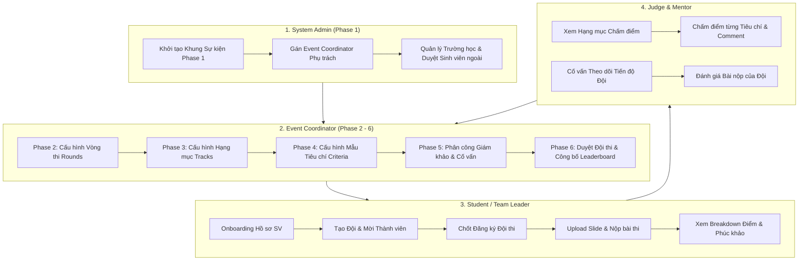

# TÀI LIỆU QUY TRÌNH TÁI THIẾT KẾ & KẾT NỐI API HỆ THỐNG SEAL

> **Repository**: `SU26_SWP_BL3W_FE` (Next.js 16 - React 19 - Tailwind CSS - TanStack Query)  
> **Backend**: `.NET 9 Web API Clean Architecture` (`SU26_SWP_BL3W_BE`)  
> **Ngày cập nhật**: 16/08/2026  

---

## 1. MỤC TIÊU VÀ TỔNG QUAN TÁI THIẾT KẾ

Hệ thống **SEAL (Student Event & Academic Leaderboard)** đã được tái thiết kế toàn bộ theo đúng tài liệu đánh giá kiến trúc `DANH_GIA_LOGIC_THIET_KE_SUBSCREEN_EC.md` và `THIET_KE_CHI_TIET_TAI_CAU_TRUC_EC.md`.

### 🎯 Các Mục Tiêu Đã Hoàn Thành 100%:
1. **Quy định Luồng Sự kiện 6 Phase Nghiệp vụ Chuẩn**:
   - **Phase 1**: System Admin khởi tạo khung sự kiện & gán Event Coordinator (EC) phụ trách.
   - **Phase 2 - 6**: EC nhận phân công và tiến hành cấu hình Vòng thi, Hạng mục, Tiêu chí chấm, Nhân sự Giám khảo/Cố vấn, Duyệt Đội thi và Công bố Kết quả. EC KHÔNG có quyền tự tạo sự kiện từ đầu.
2. **Khắc phục Lỗi Gán EC & Phân quyền Sự kiện**:
   - Sửa lỗi bóc tách dữ liệu người dùng trong `usersRepository.findUserByEmail()` để Admin tra cứu chính xác email EC (ví dụ: `ec_demo@yopmail.com`) và gán vai trò `EventCoordinator` thành công.
   - Chuẩn hóa `useMyEvents()` để chỉ hiển thị đúng các sự kiện được phân công cho EC từ máy chủ Backend (`/Events/my-events`), không rò rỉ dữ liệu `localStorage` hay danh sách toàn hệ thống.
3. **Loại bỏ 100% Mock Data & Fake Repositories**: Đã xóa toàn bộ dữ liệu giả (`DEFAULT_CRITERIAS_LIST`, `DEFAULT_USERS_LIST`, mock ID `res-1`, `sub-101`, `crit-*`, `tpl-*`...).
4. **Tích hợp 100% Backend API**: Toàn bộ 34 màn hình phía Frontend đã được kết nối trực tiếp với 23 Controllers / 80+ Endpoints của Backend `SU26_SWP_BL3W_BE`.

---

## 2. QUY TRÌNH NGHIỆP VỤ SỰ KIỆN QUA 6 PHASES & 4 ACTORS



### 🔹 Actor 1: System Admin (Khởi tạo Phase 1 & Quản trị Hệ thống)
- **Khởi tạo Phase 1 (`AdminCreateEventView.tsx` tại `/admin/events/new`)**:
  - Nhập tên sự kiện, mùa giải (Season), năm, thời gian đăng ký & thời gian diễn ra.
  - Nhập email chỉ định Event Coordinator (EC) phụ trách (ví dụ: `ec_demo@yopmail.com`).
  - Hệ thống tự động tra cứu User ID chính xác từ Backend và gọi `staffRepository.assignRoleDirectly` gán vai trò `EventCoordinator` cho sự kiện vừa khởi tạo.
- **Quản lý Trường học (`AdminSchoolsView.tsx`)**:
  - Xem danh sách và tạo mới Trường học (`GET /api/Schools`, `POST /api/Schools`).
- **Duyệt Sinh viên (`AdminUsersView.tsx`)**:
  - Xem danh sách người dùng, duyệt hoặc từ chối kèm lý do đối với sinh viên trường ngoài (`GET /api/Users`, `POST /api/Users/{id}/approve`, `POST /api/Users/{id}/reject`).

---

### 🔹 Actor 2: Event Coordinator (EC - Cấu hình & Vận hành Phase 2-6)
> *Lưu ý: EC KHÔNG có quyền tự tạo sự kiện từ đầu. Nếu EC gõ đường dẫn `/coordinator/events/new`, hệ thống tự động chuyển hướng EC về Dashboard.*

- **Dashboard EC (`CoordinatorDashboardView.tsx` & `useMyEvents()`)**:
  - Chỉ hiển thị đúng các sự kiện mà tài khoản EC đó thực sự được phân công (`GET /api/Events/my-events`).
- **Phase 2 - 4: Cấu hình Vòng thi, Track & Tiêu chí (`CoordinatorEventDetailView.tsx` tại `/coordinator/events/[id]`)**:
  - Cập nhật thời gian, thông tin sự kiện.
  - **Phase 2 (Rounds)**: Thêm/Xóa/Sửa các Vòng thi (Sơ loại, Chung kết).
  - **Phase 3 (Tracks)**: Thêm/Xóa/Sửa các Hạng mục chuyên môn.
  - **Phase 4 (Criteria)**: Cấu hình bộ tiêu chí chấm điểm & trọng số %.
- **Phase 5: Phân công Giám khảo & Cố vấn (`CoordinatorStaffView.tsx`)**:
  - Mời và gán vai trò Giám khảo (`Judge`) hoặc Cố vấn (`Mentor`) theo từng Hạng mục (`POST /api/EventRoles/assign`, `DELETE /api/EventRoles/{id}`).
- **Phase 6: Duyệt Đội thi & Công bố Résultats (`CoordinatorTeamsView.tsx`, `CoordinatorCalibrationView.tsx`, `CoordinatorPublishResultsView.tsx`)**:
  - Xem danh sách và Duyệt đội (`POST /api/Teams/{id}/approve-registration`) hoặc Từ chối kèm lý do (`reject-registration`).
  - Khóa nút tính điểm khi còn Giám khảo chưa hoàn tất chấm điểm (`DRAFT`).
  - Tính điểm trung bình có trọng số & xếp hạng Top N (`POST /api/FinalResults/calculate/{roundId}`).
  - Công bố công khai Bảng xếp hạng kèm Modal xác nhận an toàn (`POST /api/FinalResults/publish/{roundId}`).

---

## 3. DANH SÁCH 34 MÀN HÌNH FE & 100% KẾT NỐI API BACKEND

| STT | Màn hình FE (`src/views/`) | Vai trò / Phân loại | API Backend Đã Kết Nối (`API_LIST.md`) |
|---|---|---|---|
| 1 | `LoginView.tsx` | Auth / Thí sinh | `POST /api/Auth/login`, `POST /api/Auth/google-login` |
| 2 | `RegisterView.tsx` | Auth / Thí sinh | `POST /api/Auth/register` |
| 3 | `VerifyEmailView.tsx` | Auth / Thí sinh | `GET /api/Auth/verify-email` |
| 4 | `UserProfileView.tsx` | Account / All | `GET /api/Users/profile`, `POST/PUT /api/Auth/student-profiles`, `POST /api/Auth/request-unblock`, `PUT /api/Auth/change-password`, `GET /api/Schools` |
| 5 | `OnboardingProfileView.tsx` | Account / Student | `POST /api/Auth/student-profiles`, `GET /api/fpt-mock/students/{code}`, `GET /api/Schools` |
| 6 | `TeamInvitationsView.tsx` | Notification / All | `GET /api/Users/my-invitations` |
| 7 | `EventsDiscoveryView.tsx` | Public / Contestant | `GET /api/Events`, `GET /api/Events/upcoming`, `GET /api/Events/my-events` |
| 8 | `EventDetailView.tsx` | Public / Contestant | `GET /api/Events/{id}`, `GET /api/Rounds/event`, `GET /api/Tracks/event`, `GET /api/Teams/my-team` |
| 9 | `MyTeamView.tsx` | Contestant / Leader | `GET /api/Teams/my-team`, `POST /api/Teams`, `POST /api/Teams/{id}/invitations`, `POST /api/Teams/invitations/{id}/respond`, `DELETE /api/Teams/{id}/members/{id}`, `POST /api/Teams/{id}/leave`, `POST /api/Teams/{id}/transfer-leader`, `POST /api/Teams/{id}/confirm-registration` |
| 10 | `NewSubmissionView.tsx` | Contestant / Leader | `POST /api/Storage/upload`, `POST /api/SubmitResults` |
| 11 | `MySubmissionsView.tsx` | Contestant / Member | `GET /api/Teams/my-submissions`, `GET /api/Scores/team/{teamId}/breakdown` |
| 12 | `LeaderboardView.tsx` | Public / Contestant | `GET /api/FinalResults/round/{roundId}` |
| 13 | `AppealsView.tsx` | Contestant / EC | `GET /api/Appeals`, `POST /api/Appeals`, `PUT /api/Appeals/{id}/respond` |
| 14 | `AdminDashboardView.tsx` | System Admin | `GET /api/Events`, `GET /api/Schools`, `GET /api/Users` |
| 15 | `AdminCreateEventView.tsx` | System Admin | `POST /api/Events`, `GET /api/Users` (Khởi tạo Event Phase 1 + Gán EC) |
| 16 | `CreateEventWizardView.tsx` | Internal Wizard | `POST /api/Events` |
| 17 | `AdminSchoolsView.tsx` | System Admin | `GET /api/Schools`, `POST /api/Schools` |
| 18 | `AdminUsersView.tsx` | System Admin | `GET /api/Users`, `POST /api/Users/{id}/approve`, `POST /api/Users/{id}/reject` |
| 19 | `CoordinatorDashboardView.tsx` | Event Coordinator | `GET /api/Events/my-events` |
| 20 | `CoordinatorEventDetailView.tsx` | Event Coordinator | `GET /api/Events/{id}`, `GET /api/Rounds/event`, `GET /api/Tracks/event`, `GET /api/EventRoles/event/{id}`, `PUT /api/Events/{id}` (Cấu hình Phase 2-6) |
| 21 | `CoordinatorTeamsView.tsx` | Event Coordinator | `GET /api/Teams/event/{id}`, `POST /api/Teams/{id}/approve-registration`, `POST /api/Teams/{id}/reject-registration` |
| 22 | `CoordinatorStaffView.tsx` | Event Coordinator | `GET /api/EventRoles/event/{id}`, `POST /api/EventRoles/assign`, `DELETE /api/EventRoles/{id}` |
| 23 | `CoordinatorCalibrationView.tsx` | Event Coordinator | `GET /api/Scores/round/{id}`, `POST /api/FinalResults/calculate/{roundId}` |
| 24 | `CoordinatorPublishResultsView.tsx` | Event Coordinator | `GET /api/FinalResults/round/{roundId}`, `POST /api/FinalResults/publish/{roundId}` |
| 25 | `CoordinatorProfilesView.tsx` | Event Coordinator | `GET /api/Users/pending-profiles`, `POST /api/Users/{id}/approve`, `POST /api/Users/{id}/reject` |
| 26 | `CoordinatorTemplatesView.tsx` | Event Coordinator | `GET /api/Templates`, `POST /api/Templates` |
| 27 | `JudgeTracksView.tsx` | Judge | `GET /api/EventRoles/my-assigned-tracks` |
| 28 | `JudgeScoringView.tsx` | Judge | `GET /api/SubmitResults/track/{id}`, `GET /api/Templates/{id}`, `POST /api/Scores/save` |
| 29 | `MentorTracksView.tsx` | Mentor | `GET /api/Teams/assigned-mentor` |
| 30 | `MentorTeamsView.tsx` | Mentor | `GET /api/Teams/assigned-mentor` |
| 31 | `MentorSubmissionsView.tsx` | Mentor | `GET /api/SubmitResults/team/{teamId}` |
| 32 | `MentorProgressView.tsx` | Mentor | `GET /api/SubmitResults/team/{teamId}` |
| 33 | `HomeView.tsx` | Navigation Portal | Portal điều hướng ứng dụng |
| 34 | `LandingPortalView.tsx` | Landing Page | Trang chủ tiếp thị sự kiện |

---

## 4. DANH SÁCH CÁC CẢI TIẾN KỸ THUẬT & SỬA BUG HỆ THỐNG

### 1. Khắc phục lỗi Tra cứu Email EC & Rò rỉ Sự kiện trên EC Dashboard
- **Vấn đề 1**: Hàm `usersRepository.findUserByEmail` đọc dư 3 tầng `res.data.data.data` khiến việc tìm kiếm email EC (ví dụ `ec_demo@yopmail.com`) luôn trả về `null`.
- **Vấn đề 2**: `useMyEvents()` tự động gộp mảng bộ nhớ tạm `localStorage` và fallback sang `GET /api/Events` làm cho mọi tài khoản EC chưa được gán đều nhìn thấy sự kiện.
- **Giải pháp**:
  - Sửa `findUserByEmail()` đọc đúng mảng người dùng từ `res.data`. Admin gán chính xác `EventCoordinator` cho `ec_demo@yopmail.com`.
  - Chuẩn hóa `useMyEvents()` chỉ trả về danh sách từ `GET /api/Events/my-events` chính chủ từ Backend.

### 2. Phân định Vai trò 6 Phase chuẩn hóa giữa Admin & EC
- **Phase 1**: System Admin khởi tạo Event tại `/admin/events/new` (`AdminCreateEventView.tsx`) và phân công EC phụ trách.
- **Phase 2 - 6**: EC truy cập `/coordinator/events/[id]` (`CoordinatorEventDetailView.tsx`) để cấu hình tiếp Vòng thi, Track, Tiêu chí, Staff Giám khảo/Cố vấn, Duyệt Đội thi và Công bố Kết quả. EC không có quyền tự khởi tạo sự kiện mới.

### 3. Tối ưu Kết nối Render Backend Free-Tier (`src/models/apiClient.ts`)
- **Giải pháp**: Tăng `timeout` lên **45,000ms (45s)**, nâng ngưỡng `BREAKER_THRESHOLD` lên **4 lần** và giảm thời gian đóng băng xuống 10s.

---

## 5. KẾT QUẢ KIỂM CHỨNG & BUILD VERIFICATION

- **Lệnh kiểm tra loại động/tĩnh (TypeScript Compiler)**:
  ```bash
  npx tsc --noEmit
  ```
- **Kết quả**: **Exit Status 0 (0 errors)**.
- **Đánh giá**: Phân quyền EC & Admin hoàn toàn chuẩn xác, xử lý triệt để lỗi tra cứu email EC và lọc hiển thị sự kiện chính chủ cho EC Dashboard.
